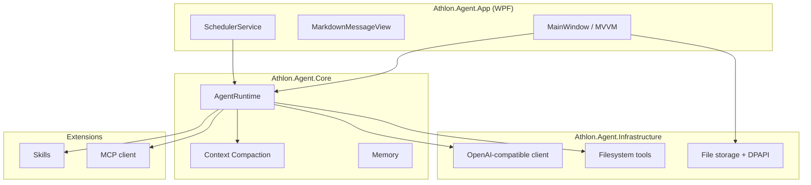

<div align="center">

# Athlon Agent

**A native Windows desktop AI coding agent — local-first, OpenAI-compatible, built with .NET 8 WPF.**

Chat with any LLM, explore and edit your workspace, run tools in an agent loop, schedule recurring tasks, and extend with Skills & MCP — all from a polished desktop app.

[](https://dotnet.microsoft.com/)
[](https://github.com/karsonto/athlon-work)
[](https://github.com/karsonto/athlon-work)
[](https://github.com/karsonto/athlon-work/actions)

[Features](#-features) · [Quick Start](#-quick-start) · [Screenshots](#-screenshots) · [Architecture](#-architecture) · [Contributing](#-contributing) · [Docs](#-documentation)

If Athlon Agent saves you time, consider giving it a **⭐** — it helps others discover the project.

</div>

---

## ✨ Why Athlon Agent?

Most AI coding assistants are either web-only or Electron-heavy. Athlon Agent is different:

| | |
|---|---|
| **Native Windows** | Real WPF UI — fast, crisp, no embedded browser for chat |
| **Bring your own model** | OpenAI-compatible APIs (OpenAI, DeepSeek, Ollama, LM Studio, …) |
| **Agent loop built-in** | Multi-step tool calling with filesystem, grep, glob, shell |
| **Token-smart** | Optional dynamic context compaction, hygiene, and MCP tool search |
| **Extensible** | Skills (AgentScope-style), MCP servers, sub-agents |
| **Private by default** | Settings, sessions, and API keys stay under your user profile (DPAPI) |

---

## 🚀 Features

### Chat & Workspace
- Codex-like chat timeline with tool-call cards, reasoning display, and session history
- Multi-workspace support with file tree, in-app editor (AvalonEdit), and workspace guard
- Native Markdown rendering (MdXaml) with code-block copy, Mermaid offline preview
- Light / dark themes with consistent Indigo accent ([theme conventions](docs/development/theme-and-ui-conventions.md))

### Agent Runtime
- Shared `AgentRuntime`: prompt building, streaming, tool dispatch, multi-round loops
- Built-in tools: `file_list`, `file_read`, `file_write`, `file_edit`, `grep_files`, `glob_files`, `execute_command`
- Sub-agent delegation (`call_assistant`) with configurable nesting depth
- Long-term memory hooks and context compaction pipeline

### Automation & Integration
- **Scheduled tasks** — daily, interval, one-shot, or manual; per-task workspace & prompt
- **Skills** — YAML + Handlebars templates in `~/.athlon-agent/skills/`
- **MCP** — server configuration UI and stdio client foundation
- **Velopack** packaging — Setup.exe, portable zip, intranet auto-update feed

### Safety & Ops
- API keys encrypted with Windows DPAPI (not plain JSON)
- JSONL audit logs for tool calls and HTTP interactions
- GitHub Actions CI + tag-based releases

---

## 📸 Screenshots

> Add screenshots to `docs/images/` and embed them here — PRs welcome!

<p align="center">
  
  <br />
  <sub>Native WPF shell · dual themes · scheduled tasks · workspace editor</sub>
</p>

---

## ⚡ Quick Start

### Prerequisites

- Windows 10/11
- [.NET 8 SDK](https://dotnet.microsoft.com/download/dotnet/8.0)

### Run from source

```powershell
git clone https://github.com/karsonto/athlon-work.git
cd athlon-work
dotnet run --project src/Athlon.Agent.App/Athlon.Agent.App.csproj
```

### First launch

1. Open **Settings** and set your OpenAI-compatible **endpoint**, **model**, and **API key**.
2. Add a **workspace** folder the agent can read and edit.
3. Start chatting — the agent will use tools to explore files on demand.

### Debug builds (skip license gate)

```powershell
$env:ATHLON_SKIP_LICENSE = "1"
dotnet run --project src/Athlon.Agent.App/Athlon.Agent.App.csproj
```

---

## 🏗 Architecture



```text
src/
  Athlon.Agent.App/             WPF UI, view models, scheduler, themes
  Athlon.Agent.Core/            Agent runtime, settings, compaction, memory
  Athlon.Agent.Infrastructure/  LLM client, tools, storage, licensing
  Athlon.Agent.Mcp/             MCP client foundation
  Athlon.Agent.Skills/          Skill loading and Handlebars rendering
tests/
  Athlon.Agent.Tests/           xUnit tests
```

---

## 🛠 Build & Test

```powershell
dotnet build Athlon.Agent.slnx
dotnet test Athlon.Agent.slnx
```

If the app is running and locks output files:

```powershell
dotnet build src/Athlon.Agent.App/Athlon.Agent.App.csproj -p:OutDir=.\artifacts\verify\out\
```

### Release packaging (Velopack)

```powershell
dotnet tool install -g vpk --version 0.0.1298
.\build.bat 1.0.0
```

Outputs under `Releases/`: `AthlonAgent-Setup.exe`, portable zip, and update nupkg. See [Auto-Update](#auto-update-intranet) for intranet deployment.

---

## ⚙️ Configuration

Runtime data lives under `%USERPROFILE%\.athlon-agent\`:

```text
.athlon-agent/
  config/        settings.json, license.lic
  sessions/      conversation history (JSONL + Markdown)
  skills/        SKILL.md folders
  logs/          Serilog logs
  credentials/   DPAPI-encrypted API keys
  audit/         tool-call audit JSONL
  training-data/ SFT + DPO training data (JSONL, opt-in)
```

### Model settings (in-app or `config/settings.json`)

| Setting | Description |
|---------|-------------|
| Endpoint | OpenAI-compatible base URL |
| Model | Chat model identifier |
| API key | Stored with DPAPI locally |
| Max tokens | Optional; empty = API default |

### Built-in tools (summary)

| Tool | Purpose |
|------|---------|
| `file_list` / `glob_files` / `grep_files` | Discover and search workspace |
| `file_read` | Stream-read with line limits and offset |
| `file_write` / `file_edit` | Create or patch files (with backup) |
| `execute_command` | Shell via `cmd.exe /c` (deny-list + user stop) |

Details: workspace guard, timeouts, and compaction → [Context compaction](docs/features/context-compaction.md).

### Agent turn timeout

```json
{
  "AgentTurn": {
    "TimeoutMinutes": 120
  }
}
```

`0` = disabled (only manual Stop ends the run). Range: 1–180 minutes.

---

## 📦 Auto-Update (Intranet)

The client checks an **internal HTTP update server** (not GitHub directly):

1. Sync `Releases/` from a GitHub Release to e.g. `https://update.corp.local/athlon-agent/`.
2. Configure `config/settings.json`:

```json
{
  "Update": {
    "Enabled": true,
    "BaseUrl": "https://update.corp.local/athlon-agent"
  }
}
```

Or set `ATHLON_UPDATE_URL`. Push a tag to trigger CI release:

```powershell
git tag v1.0.0
git push origin v1.0.0
```

---

## 📚 Documentation

| Doc | Description |
|-----|-------------|
| [Theme & UI conventions](docs/development/theme-and-ui-conventions.md) | Color tokens, theme switch rules (for contributors & AI) |
| [Context compaction](docs/features/context-compaction.md) | Dynamic compaction, hygiene, eviction |
| [License tooling](tools/license/README.md) | RSA license generation for enterprise deployments |
| [Training data flywheel](docs/development/training-data-flywheel.md) | Auto-extracting SFT/DPO training data from agent interactions |

---

## 🤝 Contributing

Contributions are welcome — whether it's a bug fix, a new tool, UI polish, docs, or tests.

**Start here:** [CONTRIBUTING.md](CONTRIBUTING.md) — setup, architecture rules, PR checklist, and commit style.

Quick summary:

1. **Fork** the repo and create a branch from `main`
2. **Follow** existing MVVM / service patterns — keep model logic out of WPF views
3. **Read** [theme & UI conventions](docs/development/theme-and-ui-conventions.md) before UI changes
4. **Run** `dotnet build` and `dotnet test` before opening a PR
5. **Keep** persistence file-based via `IAppPathProvider` (no hardcoded `%LocalAppData%`)

### Good first issues

- Add tests for `AppPathProvider`, workspace guard, filesystem tools
- MCP server lifecycle: connect, `tools/list`, `tools/call`, status UI
- Command execution confirmation dialog
- Session branch management
- Screenshots for the README

### Notes for AI-assisted development

- Extend `AgentRuntime`, `AgentEnvironmentPromptBuilder`, and tools — not the WPF layer
- UI logic → `Athlon.Agent.App/ViewModels/`
- Theme colors → palette tokens only; subscribe `ThemeChanged` when caching brushes
- `.pen` design files → Pencil MCP tools only
- **Training data collection** — every tool call, error, and user correction flows through `CorrectionDetector` and produces SFT/DPO samples automatically. When extending the agent loop:
  - Add new `CorrectionDetector.Detect*()` methods for new trajectory types
  - Wire extraction into `TurnTrajectoryExtractor.Extract*Samples()` 
  - Register in `TrainingSampleStore.RecordTurnAsync()` (see [training data flywheel](docs/development/training-data-flywheel.md))

---

## 🔐 License

Athlon Agent ships with **AD-account-bound license validation** for enterprise deployments. Each license is signed (RSA-2048) and tied to a Windows domain account.

| Audience | How to run |
|----------|------------|
| **Developers** | Debug build + `ATHLON_SKIP_LICENSE=1` |
| **Enterprise** | Issue `.lic` via [`tools/license/`](tools/license/README.md) |

License lookup order:

1. `license.lic` next to `Athlon.Agent.App.exe`
2. `%USERPROFILE%\.athlon-agent\config\license.lic`

This is offline signature validation for internal compliance — not DRM. The **source code is open** for inspection, learning, and contribution; production use in licensed environments requires a valid license file.

---

## 🗺 Roadmap

- [ ] Full MCP server lifecycle (connect, list tools, call, reconnect)
- [ ] Command execution confirmation UI
- [ ] Session branching
- [ ] Richer code-block actions (diff, run)
- [ ] Optional code signing in release pipeline
- [ ] README screenshots & demo GIF

---

## ⭐ Star History

If you find Athlon Agent useful, **star the repo** to support the project and help other developers discover it.

---

<p align="center">
  <sub>Built with .NET 8 · WPF · CommunityToolkit.Mvvm · Serilog · MdXaml · Velopack</sub>
</p>
